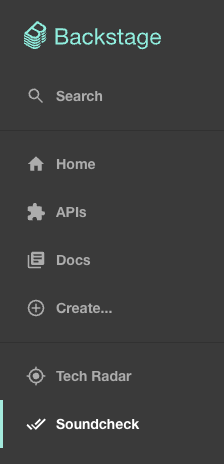
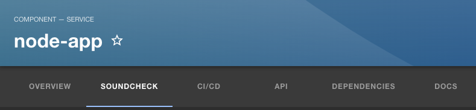

# [Backstage and Soundcheck Tutorial](https://backstage.io)

This is meant to be a guide for getting Soundcheck up and running.  Each section of the read me walks through a commit done to install and use Soundcheck.  The application can be run from any commit in this repo.

To start the app, run:

```sh
yarn install
yarn dev
```

## Initial Backstage Setup

### Commit #1: [Create Repo](https://github.com/ThayerAltman/example-backstage/commit/00a9be8c1694e2cc911b8e94aae9ba342dfb8c6e)

This repo was created by following the [Backstage installation](https://backstage.spotify.com/learn/standing-up-backstage/standing-up-backstage/2-install-app/) instructions

### Commit #2: [Configuration](https://github.com/ThayerAltman/example-backstage/commit/64f470394c5ec8022af05d47247db0723e69bbd4)

This commit consists of following instructions from [Setting up PostgreSQL](https://backstage.spotify.com/learn/standing-up-backstage/configuring-backstage/5-config-2/) to [Setting up Authentication](https://backstage.spotify.com/learn/standing-up-backstage/configuring-backstage/7-authentication/).

To run the application, an app-config.local.yaml will need to be added.  It will something look like:

```yaml
backend:
  database:
    connection:
      host: localhost
      # Default postgresql port is 5432.  50576 is arbitrary, 5432 is in use by a another application.
      port: 50576
      user: postgres
      # Replace the password below with your postgresql password:
      password: <secret>
auth:
  # see https://backstage.io/docs/auth/ to learn about auth providers
  environment: development
  providers:
    github:
      development:
        clientId: <client_id>
        clientSecret: <secret_key>
integrations:
  github:
    - host: github.com
      token: <github_token>
```

1. `<client_id>` and `<secret_key>` are created [here](https://backstage.spotify.com/learn/standing-up-backstage/configuring-backstage/7-authentication/)

2. `<github_token>` is created [here](https://backstage.spotify.com/learn/standing-up-backstage/putting-backstage-into-action/8-integration/)

## SoundCheck Install

Add the Spotify license key to you app-config-local.yaml

```yaml
spotify:
  licenseKey: <license_key>
```

The `<license_key>` can be found by going to [Backstage Account Overview](https://backstage.spotify.com/account/)

### Commit #3: [Soundcheck Installtion and Setup](https://github.com/ThayerAltman/example-backstage/commit/b145d6aacd51fb00189dfd542d8b0eb41e8fbc97)

This commit consists of following the Soundcheck installation instructions:

1. [Backend Installation](https://www.npmjs.com/package/@spotify/backstage-plugin-soundcheck-backend#1-install-the-plugins)
2. [Frontend Installation](https://www.npmjs.com/package/@spotify/backstage-plugin-soundcheck)

At this point Soundcheck is installed, but it is not doing anything.

The menu bar on the left should be visible:



As well as the tab menu when viewing an entity:



Changes made to the [app-config.yaml](https://github.com/ThayerAltman/example-backstage/commit/bbfa3ffd0990197b3aa7355016a40c2045340fee#diff-ec52f22d476ccc33271d11c4f08a68369614378aa0cb9aa5aba2f08943cd68df) include adding:

```yaml
soundcheck:
  programs:
    $include: ./soundcheck/soundcheck-empty-program.yaml
```

Here an empty program was added to Soundcheck.  A valid program is needed for the plugin to start.

Addtionally [soundcheck-empty-program.yaml](https://github.com/ThayerAltman/example-backstage/commit/bbfa3ffd0990197b3aa7355016a40c2045340fee#diff-ec52f22d476ccc33271d11c4f08a68369614378aa0cb9aa5aba2f08943cd68df) is the empty Soundcheck program referenced in the app-config.yaml:

```yaml
---
- id: empty-program
  name: Empty Program
  ownerEntityRef: group:default/example-owner
  description: >
    Empty
  documentationURL: 
  levels:
    - ordinal: 1
      checks:
        - id: empty_check
          name: Empty Check
          description: >
            Empty description
```

## Soundcheck Configuration

In order to see Soundcheck in action, an entity will need to be added to the catalog.  Using the register existing component button, register a simple [entity](https://github.com/ThayerAltman/node-app/blob/master/catalog-info.yaml)

### Commit #4: [Add GitHub Collector and Basic Program](https://github.com/ThayerAltman/example-backstage/commit/066bad9b34df78b293c90747d7544bac0b888123)

This commit adds a simple program that involves using the GitHub fact collector to verify the following:

1. The repo has less than ten open issues.
2. The repo's default branch is named main
3. The repo is private.

This is accomplished by defining the program in `soundcheck-programs.yaml`.  This file represents the entire tech health initiative.  In this case there is only one level (Basic Setup), in later steps there will be more levels added.

```yaml
---
- id: basic-setup
  name: Basic Setup
  ownerEntityRef: group:default/example-owner
  description: >
    Improve quality and reliability of your software component
    by measuring the use of testing best practices.
  documentationURL: https://www.backstage.io
  levels:
    - ordinal: 1
      checks:
        - id: has_less_than_ten_open_issues
          name: Less than 10 open issues
          description: >
            The service should have less than 10 open issues
        - id: is_repo_private
          name: The GitHub repo is private
          description: >
            All repos need to private.
        - id: default_branch_is_main
          name: The default branch is main
          description: >
            Default branches should be named main
```
Each of the above program checks coorespond to a check in the `soundcheck-checks.yaml`:
```yaml
---
- id: has_less_than_ten_open_issues
  rule:
    factRef: github:default/repo_details
    path: $.open_issues
    operator: lessThan
    value: 10
  passedMessage: |
    Less than 10 open issues
  failedMessage: |
    Ten or more open issue(s)
- id: is_repo_private
  rule:
    factRef: github:default/repo_details
    path: $.private
    operator: equal
    value: true
  passedMessage: |
    Repo is private
  failedMessage: |
    Repo is not private, change repo to private
- id: default_branch_is_main
  rule:
    factRef: github:default/repo_details
    path: $.default_branch
    operator: equal
    value: main
  passedMessage: |
    Default banch is main
  failedMessage: |
    Change default branch to main
```

Note: The names of the checks in `soundcheck-checks.yaml` and `soundcheck-programs.yaml` must match.  The above file defines what each check is actually checking for.  As an example:

```yaml
- id: has_less_than_ten_open_issues
  rule:
    factRef: github:default/repo_details
    path: $.open_issues
    operator: lessThan
    value: 10
  passedMessage: |
    Less than 10 open issues
  failedMessage: |
    Ten or more open issues
```

`default_branch_is_main` will verify that the given repository has less than ten open issues.  Under the hood, Soundcheck is calling the GitHub API https://api.github.com/repos/{org}/{repo} using the provided GitHub token.  An example *truncated* response is as follows:

<pre tabindex="0" id="json" style="max-height: 165px;" type="application/json">
{
    "id": 616657405,
    "node_id": "R_kgDOJMFx_Q",
    "name": "node-app",
    "full_name": "ThayerAltman/node-app",
    "private": true,
    "owner": {
        "login": "ThayerAltman",
        "id": 110566684
    },
    "open_issues_count": 2,
    "license": null,
    "allow_forking": true,
    "is_template": false,
    "web_commit_signoff_required": false,
    "topics": [],
    "visibility": "private",
    "forks": 0,
    "open_issues": 2,
    "watchers": 0,
    "default_branch": "master",
    "permissions": {
        "admin": true,
        "maintain": true,
        "push": true,
        "triage": true,
        "pull": true
    },
    "temp_clone_token": "A2LR2HDARSRGLWJVJDSFZPTEJGH2S",
    "allow_squash_merge": true,
    "allow_merge_commit": true,
    "allow_rebase_merge": true,
    "allow_auto_merge": false,
    "delete_branch_on_merge": false,
    "allow_update_branch": false,
    "use_squash_pr_title_as_default": false,
    "squash_merge_commit_message": "COMMIT_MESSAGES",
    "squash_merge_commit_title": "COMMIT_OR_PR_TITLE",
    "merge_commit_message": "PR_TITLE",
    "merge_commit_title": "MERGE_MESSAGE",
    "network_count": 0,
    "subscribers_count": 1
}
</pre>

The GitHub Fact Collector will look at the value of `"open_issues"` and determine if the value is less than 10.

The final piece of the Soundcheck program is the `github-facts-collectors.yaml`.  This file determine what facts will be collected about the elligible entities.

```yaml
---
frequency:
  cron: '* * * * *'
filter:
  kind: 'Component'
cache:
  duration:
    hours: 2
collects:
  - factName: repo_details
    type: RepositoryDetails
    cache: true
```
In this case the `RepositoryDetails` fact will be collected, and the name of the fact will be `repo_details`.  The cron value is `'* * * * *'`, which indicates fact will be collected every minute.  Every minute is **far** to frequent, but works great in demos :sweat_smile: .  Finally the cache duration is set to 2 hours.  This means something.