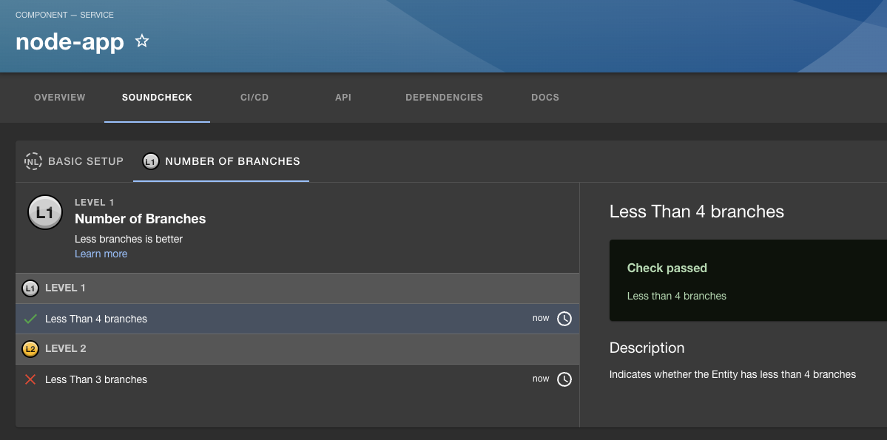

# [Backstage and Soundcheck Tutorial](https://backstage.io)

This is meant to be a guide for getting Soundcheck up and running.  Each section of the README walks through a commit done to install and use Soundcheck.  The application can be run from any commit in this repo.

To start the app, run:

```sh
yarn install
yarn dev
```

## Initial Backstage Setup

### Commit #1: [Create Repo](https://github.com/ThayerAltman/example-backstage/commit/00a9be8c1694e2cc911b8e94aae9ba342dfb8c6e)

This repo was created by following the [Backstage installation](https://backstage.spotify.com/learn/standing-up-backstage/standing-up-backstage/2-install-app/) instructions

### Commit #2: [Configuration](https://github.com/ThayerAltman/example-backstage/commit/64f470394c5ec8022af05d47247db0723e69bbd4)

This commit consists of following instructions from [Setting up PostgreSQL](https://backstage.spotify.com/learn/standing-up-backstage/configuring-backstage/5-config-2/) to [Setting up Authentication](https://backstage.spotify.com/learn/standing-up-backstage/configuring-backstage/7-authentication/).

To run the application, an app-config.local.yaml will need to be added.  It will something look like:

```yaml
backend:
  database:
    connection:
      host: localhost
      # Default postgresql port is 5432.  50576 is arbitrary, 5432 is in use by another application.
      port: 50576
      user: postgres
      # Replace the password below with your postgresql password:
      password: <secret>
auth:
  # see https://backstage.io/docs/auth/ to learn about auth providers
  environment: development
  providers:
    github:
      development:
        clientId: <client_id>
        clientSecret: <secret_key>
integrations:
  github:
    - host: github.com
      token: <github_token>
```

1. `<client_id>` and `<secret_key>` are created [here](https://backstage.spotify.com/learn/standing-up-backstage/configuring-backstage/7-authentication/)

2. `<github_token>` is created [here](https://backstage.spotify.com/learn/standing-up-backstage/putting-backstage-into-action/8-integration/)

## SoundCheck Install

Add the Spotify license key to you app-config-local.yaml

```yaml
spotify:
  licenseKey: <license_key>
```

The `<license_key>` can be found by going to [Backstage Account Overview](https://backstage.spotify.com/account/)

### Commit #3: [Soundcheck Installation and Setup](https://github.com/ThayerAltman/example-backstage/commit/b145d6aacd51fb00189dfd542d8b0eb41e8fbc97)

This commit consists of following the Soundcheck installation instructions:

1. [Backend Installation](https://www.npmjs.com/package/@spotify/backstage-plugin-soundcheck-backend#1-install-the-plugins)
2. [Frontend Installation](https://www.npmjs.com/package/@spotify/backstage-plugin-soundcheck)

At this point Soundcheck is installed, but it is not doing anything.

The menu bar on the left should be visible:


As well as the tab menu when viewing an entity:


Changes made to the [app-config.yaml](https://github.com/ThayerAltman/example-backstage/commit/bbfa3ffd0990197b3aa7355016a40c2045340fee#diff-ec52f22d476ccc33271d11c4f08a68369614378aa0cb9aa5aba2f08943cd68df) include adding:

```yaml
soundcheck:
  programs:
    $include: ./soundcheck/soundcheck-empty-program.yaml
```

Here an empty program was added to Soundcheck.  A valid program is needed for the plugin to start.

Additionally [soundcheck-empty-program.yaml](https://github.com/ThayerAltman/example-backstage/commit/bbfa3ffd0990197b3aa7355016a40c2045340fee#diff-ec52f22d476ccc33271d11c4f08a68369614378aa0cb9aa5aba2f08943cd68df) is the empty Soundcheck program referenced in the app-config.yaml:

```yaml
---
- id: empty-program
  name: Empty Program
  ownerEntityRef: group:default/example-owner
  description: >
    Empty
  documentationURL: 
  levels:
    - ordinal: 1
      checks:
        - id: empty_check
          name: Empty Check
          description: >
            Empty description
```

## Soundcheck Configuration

In order to see Soundcheck in action, an entity will need to be added to the catalog.  Using the register existing component button, register a simple [entity](https://github.com/ThayerAltman/node-app/blob/master/catalog-info.yaml)

### Commit #4: [Add GitHub Collector and Basic Program](https://github.com/ThayerAltman/example-backstage/commit/066bad9b34df78b293c90747d7544bac0b888123)

More info can be found [here](https://www.npmjs.com/package/@spotify/backstage-plugin-soundcheck-backend-module-github).

This commit adds a simple program that involves using the GitHub fact collector to verify the following:

1. The repo has less than ten open issues
2. The repo's default branch is named main
3. The repo is private

This is accomplished by defining the program in `soundcheck-programs.yaml`.  This file represents the entire tech health initiative.  In this case there is only one level (Basic Setup), in later steps there will be more levels added.

```yaml
---
- id: basic-setup
  name: Basic Setup
  ownerEntityRef: group:default/example-owner
  description: >
    Improve quality and reliability of your software component
    by measuring the use of testing best practices.
  documentationURL: https://www.backstage.io
  levels:
    - ordinal: 1
      checks:
        - id: has_less_than_ten_open_issues
          name: Less than 10 open issues
          description: >
            The service should have less than 10 open issues
        - id: is_repo_private
          name: The GitHub repo is private
          description: >
            All repos need to be private.
        - id: default_branch_is_main
          name: The default branch is main
          description: >
            Default branches should be named main
```
Each of the above program checks correspond to a check in the `soundcheck-checks.yaml`:
```yaml
---
- id: has_less_than_ten_open_issues
  rule:
    factRef: github:default/repo_details
    path: $.open_issues
    operator: lessThan
    value: 10
  passedMessage: |
    Less than 10 open issues
  failedMessage: |
    Ten or more open issue(s)
- id: is_repo_private
  rule:
    factRef: github:default/repo_details
    path: $.private
    operator: equal
    value: true
  passedMessage: |
    Repo is private
  failedMessage: |
    Repo is not private, change repo to private
- id: default_branch_is_main
  rule:
    factRef: github:default/repo_details
    path: $.default_branch
    operator: equal
    value: main
  passedMessage: |
    Default branch is main
  failedMessage: |
    Change default branch to main
```

Note: The names of the checks in `soundcheck-checks.yaml` and `soundcheck-programs.yaml` must match.  The above file defines what each check is actually checking for.  As an example:

```yaml
- id: has_less_than_ten_open_issues
  rule:
    factRef: github:default/repo_details
    path: $.open_issues
    operator: lessThan
    value: 10
  passedMessage: |
    Less than 10 open issues
  failedMessage: |
    Ten or more open issues
```

`has_less_than_ten_open_issues` will verify that the given repository has less than ten open issues.  Under the hood, Soundcheck is calling the GitHub API https://api.github.com/repos/{org}/{repo} using the provided GitHub token.  An example *truncated* response is as follows:

```json
{
    "id": 616657405,
    "node_id": "R_kgDOJMFx_Q",
    "name": "node-app",
    "full_name": "ThayerAltman/node-app",
    "private": true,
    "owner": {
        "login": "ThayerAltman",
        "id": 110566684
    },
    "open_issues_count": 2,
    "license": null,
    "allow_forking": true,
    "is_template": false,
    "web_commit_signoff_required": false,
    "topics": [],
    "visibility": "private",
    "forks": 0,
    "open_issues": 2,
    "watchers": 0,
    "default_branch": "master",
    "temp_clone_token": "A2LR2HDARSRGLWJVJDSFZPTEJGH2S",
    "allow_squash_merge": true,
    "allow_merge_commit": true,
    "allow_rebase_merge": true,
    "allow_auto_merge": false,
    "delete_branch_on_merge": false,
    "allow_update_branch": false,
    "use_squash_pr_title_as_default": false,
    "squash_merge_commit_message": "COMMIT_MESSAGES",
    "squash_merge_commit_title": "COMMIT_OR_PR_TITLE",
    "merge_commit_message": "PR_TITLE",
    "merge_commit_title": "MERGE_MESSAGE",
    "network_count": 0,
    "subscribers_count": 1
}
```

The GitHub Fact Collector will look at the value of `"open_issues"` and determine if the value is less than 10.

The final piece of the Soundcheck program is the `github-facts-collectors.yaml`.  This file determines what facts will be collected about the eligible entities.

```yaml
---
frequency:
  cron: '* * * * *'
filter:
  kind: 'Component'
cache:
  duration:
    hours: 2
collects:
  - factName: repo_details
    type: RepositoryDetails
    cache: true
```

In this case the `RepositoryDetails` fact will be collected, and the name of the fact will be `repo_details`.  The cron value is `'* * * * *'`, which indicates the fact will be collected every minute.  Every minute is **far** to frequent, but works great in demos :sweat_smile:.  Finally the cache duration is set to 2 hours:

```yaml
cache:
  duration:
    hours: 2
```

This means the fact itself will be cached for 2 hours.  As a result, if any check is executed while the fact is still in the cache, it will read that value instead of collecting the fact from its source.

Now if backstage is started and the Soundcheck tab is opened, it should look like:


### Commit #5 [Adding SCM Fact Collector](https://github.com/ThayerAltman/example-backstage/commit/7ed1b9da2de46f42bc102a72b7856a9af32f4261)

More info can be found [here](https://www.npmjs.com/package/@spotify/backstage-plugin-soundcheck-backend-module-scm).

This commit adds another level to the basic program and adds a whole new program.  The checks added will verify that:

1. The repo has a README.md
2. The repo has a catalog-info.yaml
3. If the repo is a python service, the github actions are running pytest (using regex)

Three checks have been added to `soundcheck-checks.yaml`:

```yaml
- id: has_readme_check # The name of the check
  rule: # How to evaluate this check
    factRef: scm:default/readme_and_catalog_info_files_exist_fact # The fact data to reference
    path: $.readme_exists # The path to the field to analyze
    operator: equal # Indicates the operation to apply
    value: true # The desired value of the field indicated in the path, above.
- id: has_catalog_info_file_check
  rule:
    factRef: scm:default/readme_and_catalog_info_files_exist_fact
    path: $.catalog_info_exists
    operator: equal
    value: true
- id: python_service_runs_tests
  rule:
    factRef: scm:default/python_service_runs_tests
    path: $.matches
    operator: equal
    value: true
```

Two of the checks `has_readme_check` and `has_catalog_info_file_check` reference the same fact `readme_and_catalog_info_files_exist_fact`
The facts are collected as per the configuration in `scm-facts-collectors.yaml`:

```yaml
frequency:
  cron: '* * * * *' # Defines a schedule for when the facts defined in this file should be collected
  # This is optional and if omitted, facts will only be collected on demand.
filter: # A filter specifying which entities to collect the specified facts for
  kind: 'Component'
cache: # Defines if the collected facts should be cached, and if so for how long
  duration:
    hours: 2
collects: # An array of fact extractor configuration describing how to collect SCM facts.
  - factName:
      readme_and_catalog_info_files_exist_fact # This gives this fact an identifier which is
      # used to refer to the fact in other
      # configuration files.
    type: exists # This identifies the type of fact to collect.
    data: # This defines the data element which will be returned in the
      # fact object when the fact is collected.
      - name: readme_exists # Label for the data element.
        path: /README.md # The file for which existence will be determined.
      - name: catalog_info_exists # Label for the data element.
        path: /catalog-info.yaml
  - factName:
      python_service_runs_tests # This gives this fact an identifier which is
      # used to refer to the fact in other
      # configuration files.
    type: regex # This identifies the type of fact to collect.
    regex:
      \s*run:\s*\|*\s*pytest.*$
    path: /.github/workflows/build.yaml
```

The first fact `readme_and_catalog_info_files_exist_fact` will collect two pieces of information:

1. readme_exists
2. catalog_info_exists

Looking at the database, this fact will look like:


Specifically the fact collected:

```json
{
  "readme_exists": true,
  "catalog_info_exists": true
}
```

Looking back at `soundcheck-checks.yaml`'s check:

```yaml
- id: has_catalog_info_file_check
  rule:
    factRef: scm:default/readme_and_catalog_info_files_exist_fact
    path: $.catalog_info_exists
    operator: equal
    value: true
```

The above path contains `$.catalog_info_exists`, which will map into the json object collected.

Additionally there is the `python_service_runs_tests` check:

```yaml
  - factName:
      python_service_runs_tests # This gives this fact an identifier which is
      # used to refer to the fact in other
      # configuration files.
    type: regex # This identifies the type of fact to collect.
    regex:
      \s*run:\s*\|*\s*pytest.*$
    path: /.github/workflows/build.yaml
```

This will look at the `/.github/workflows/build.yaml` file and determine if the regular expression `\s*run:\s*\|*\s*pytest.*$` has a match.  The goal of this regular expression is to determine if pytest is being run as part of a GitHub actions workflow.

Looking at the additions to the `soundcheck-programs.yaml`:

```yaml
    - ordinal: 2
      checks:
        - id: has_readme_check
          name: Readme exists
          description: >
            Indicates whether there is a readme in the repo.
        - id: has_catalog_info_file_check
          name: Catalog-info exists
          description: >
            Indicates the repo contains a catalog-info.yaml.
- id: test-certified
  name: Test Certified
  ownerEntityRef: group:default/example-owner
  description: >
    Improve quality and reliability of your software component
    by measuring the use of testing best practices.
  documentationURL: https://www.backstage.io
  levels:
    - ordinal: 1
      checks:
        - id: python_service_runs_tests
          name: The python service runs pytest
          description: >
            This service is currently running pytest as part of its GitHub actions workflow as defined in the build.yaml
          filter:
            catalog:
              metadata.tags: python
```

There is a filter added to the `python_service_runs_tests`:

```yaml
filter:
  catalog:
    metadata.tags: python
```

This will make this check only visible on entities labeled with `python`

In order to see this check in action, a python entity will need to be added to the catalog.  Using the register existing component button, register this [entity](https://github.com/ThayerAltman/simple-python-service/blob/master/catalog-info.yaml)

After adding the entry, the Soundcheck tab for the entry would look like:


### Commit #6 [Add Custom Fact Collector](https://github.com/ThayerAltman/example-backstage/commit/8493e493dc9df3a6b78d62321b2a838fca82cd0d)

This commit adds a custom fact collector.  In this case it will collect the number of branches that have been created for this repo.  It will do that by calling the [GitHub GraphQL API](https://docs.github.com/en/graphql) via [Oktokit](https://github.com/octokit/graphql.js/#typescript).  Any web service call can be done here, this example will highlight how to use Backstage's internal credentials.  The checks being added are:

1. The repo has less than 3 branches
2. The repo has less than 4 branches

The files added are similar to what was added in previous commits:

1. New program in `soundcheck-program.yaml`
2. New checks in `soundcheck-checks.yaml`
3. New collector in `branch-facts-collector.yaml`

**However** in this case there is also code added to facilitate the checks.

First let's look at the checks `soundcheck-checks.yaml`:

```yaml
- id: less_than_4_branches
  rule:
    factRef: branch:default/branch_count
    path: $.totalCount
    operator: lessThan
    value: 4
  passedMessage: |
    Less than 4 branches
  failedMessage: |
    4 or more branches
- id: less_than_3_branches
  rule:
    factRef: branch:default/branch_count
    path: $.totalCount
    operator: lessThan
    value: 3
  passedMessage: |
    Less than 3 branches
  failedMessage: |
    3 or more branches
```

The `factRef` with value `branch:default/branch_count` corresponds to the collector `branch-facts-collector.yaml`:

```yaml
---
frequency:
  minutes: 1
cache: # Defines if the collected facts should be cached, and if so for how long
  duration:
    hours: 2
collects:
  factName: branch_count
  type: branchDescriptor 
```

This value also corresponds to some identifiers in the code.

Looking at a portion of `branchcount.ts`:

```ts
  async collect(
    entities: Entity[],
    _params?: { factRefs?: FactRef[]; refresh?: FactRef[] },
  ): Promise<Fact[]> {
    try {
      const factRef: FactRef = stringifyFactRef({
        name: 'branch_count',
        scope: 'default',
        source: 'branch',
      });
      return Promise.all(
        entities
          .filter(entity => isScmEntity(entity))
          .map(async entity => {
            const entityRef = stringifyEntityRef(entity);
            const entityScmUrl = getEntityScmUrl(entity);
            const gitUrl = parseGitUrl(entityScmUrl);

            const { token } = await this.#credentialsProvider.getCredentials({ url: entityScmUrl });
            const response = await graphql(
              `
              query numBranches($owner: String!, $repo: String!) {
                repository(owner: $owner, name: $repo) {
                  refs(first: 0, refPrefix: "refs/heads/") {
                    totalCount
                  }
                }
              }
            `,
              {
                owner: gitUrl.owner,
                repo: gitUrl.name,
                headers: {
                  authorization: 'Bearer ' + token,
                },
              }
            ) as GraphQlQueryResponseData;
            
            console.log("BranchCountFactCollector: " + gitUrl.owner + ": " + gitUrl.name + ": " + "Total Count: "
            + response["repository"]["refs"]["totalCount"]);

            return this.buildFact(entityRef, factRef, response["repository"]["refs"]);
          }),
      );
    } catch (e) {
      this.#logger.error(`Failed to collect branch data with error: ${e}`);
      return Promise.reject([]);
    }
  }
```

The `collect` function will get the fact that is to be used for the checks.  The token needed for authentication is retrieved here:

```ts
const { token } = await this.#credentialsProvider.getCredentials({ url: entityScmUrl });
```

Finally the following section will make outbound request:

```ts
            const response = await graphql(
              `
              query numBranches($owner: String!, $repo: String!) {
                repository(owner: $owner, name: $repo) {
                  refs(first: 0, refPrefix: "refs/heads/") {
                    totalCount
                  }
                }
              }
            `,
              {
                owner: gitUrl.owner,
                repo: gitUrl.name,
                headers: {
                  authorization: 'Bearer ' + token,
                },
              }
            ) as GraphQlQueryResponseData;
```

The files `branchcountextractorsstore.ts` and `utils.ts` define how the configuration and schema work.

The basic template for creating a custom fact collector is below:

```ts
import { FactCollector } from '@spotify/backstage-plugin-soundcheck-node';
import { Entity } from '@backstage/catalog-model';
import {
  CollectionConfig,
  Fact,
  FactRef,
} from '@spotify/backstage-plugin-soundcheck-common';
​
export class ExampleFactCollector implements FactCollector {
  public static ID = 'example';
​
  public static create(): ExampleFactCollector {
    return new ExampleFactCollector();
  }
​
  collect(
    entities: Entity[],
    params?: { factRefs?: FactRef[]; refresh?: FactRef[] },
  ): Promise<Fact[]> {
    return Promise.resolve([]);
  }
​
  getCollectionConfigs(): Promise<CollectionConfig[]> {
    return Promise.resolve([]);
  }
​
  getDataSchema(factRef: FactRef): Promise<string | undefined> {
    return Promise.resolve(undefined);
  }
​
  getFactNames(): Promise<string[]> {
    return Promise.resolve([]);
  }
}
```

After starting Backstage, Soundcheck should look like:

